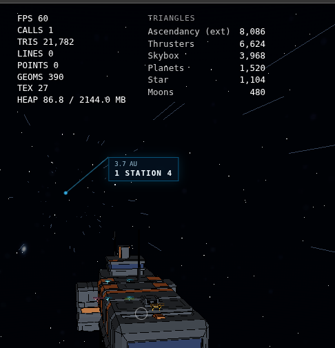

Make asteroids higher poly. Keep the current poly for a further a way LOD but on a closer scale they should look more defined. The smaller ones only need to be a bit higher poly but the bigger ones should not only be higher poly but also have more abstract shapes. The current ones just look like stretched spheres.

Make asteroid groups also spawn around planets just like moons.

Make it possible for planets to have a saturn like asteroid belt around it. Add this to the config of 2 planets already for testing. Add parameters like the starting radius and end radius and the rotation of the ring. The ring/belt should at least from a distance simply be a semi-transparent texture. When getting close enough to a part of the belt, this part should radally around the distance from the camera fade out smoothly. This should happen at 500km. The faded out part should be replaced by 2d billboard sprites that are also semi transparent and have the same color as the ring texture in that position. Eventhough they are semi transparent, them overlapping should not add the color. Getting closer than 50km should spawn actual 3d asteroids just like in the current asteroid groups. The other levels of detail of the belt such as the texture and the billboards should still be visible. To not run into performance issues, introduce frustum culling and introduce your own performance optimizations.
These single asteroids should obviously not exist as destinations for autopilot.

Improve the "hyperspeed effect" to not be a 2d visual effect ontop of the camera, but to be a "real" 3d effect with applied postprocessing thats physically around the ship (around 500m distance) and oriented the right way.

The turning can happen really fast right now. The intensity that the turn and rotation of the ship is started at is really high. it should "fade in" and slowly start turning as it is has a lot of weight

While flying the ship (in the pilot seat) allow for switching perspectives. Currently its only third person perspective where the camera orbits around the ship. When pressing a hotkey for swithcing perspectives, it toggles between third person and first person perspective. In first person perspective, the camera should be fixed in place but not rotation, 1m above the ships "pilot seat" position. The ship inside should be rendered again isntead of the outside. The controls should be identical.

Ship collisions with stations and asteroids need to work

Ship landing in stations needs to work

Add light nodes to the station models. This will allow every station to have a array of relative coordinates (that will also be shown with the debug crosshairs)

Modify velocity limiters around stations to be less strict, smaller and not apply when outside of the "outermost boundry" sphere of the station and when facing more than 120° away from the station.

Fix station safe zone shooting glitch: when the ship's center is still outside of the station's safe zone but one of the ships guns is already inside, the projectiles will fly inside the safe zone and be able to hit targets. Fix this by not firing any guns inside of safe zones aswell as not allowing projectiles to fly inside of safe zones.

Turning collision detector

The highlight tag highlighting an autopilot target currently doesnt clear when the autopilot is disengaged. This is fine, but there should always only be one highlighted tag at a time and no matter what is currently highlighted, under the "disengage autopilot" button in the navigator UI, also add the option to clear the highlighted tag, if there is one, and if its not there because of the autopilot

Ship backwards flying

BLENDER TODO: decrease glow intensity, apply array, screw stickers dont work/have no outline.

Edge shader triangle collapse: prefer straight edges/aligned with axes edges

Player height is too tall inside the ship. I used a reference in blender that was the same apparent height of 1.7m and its eyelevel was lower than the one in the game.

When disengaging autopilot at any speed, keep momentum, but as long as the ship is faster than its normal max speed, apply deceleration so that it would be stationary within 20 seconds multiplied by the ships braking multiplier

Add targeting option in the navigator UI which will always make the ship point to the target.

Make ship slowly turn horizontal while no user input

-2.79638

-7.28286

if any mesh inside a glb file has the word "organic" in its name, the "blender" like edge shader should not be applied but instead the old outline shader should be applied. Also rename this old outline shader to the "organic outline shader" and the blender like edge shader to the "geometric edge shader".

Triangle optimization:

While at asteroid field:
- Asteroid dust has 36k triangles.
- Planets have 1,5k triangles
- Star has 1,1k triangles
- Moons have 480 triangles
- Force fields have 7,4k triangles
- Skybox has 3,9k triangles
- Unclear what the category thrusters does but it has 3,9k triangles

During travel:

While at planet station:
Force fields have 52k triangles
"station1" all of a sudden has 28k triangles
Thrusters have 6,6k triangles
skybox same
planets have 2,28k triangles
star same
moons 960 triangles

Optimization:
- Force fields: Why do they have triangles in the first place? Should just get visible when shot. No triangles are being rendered before that. During shooting it mereley renders a part of the force field that was hit. optimize this. Also i have a suspicion force fields of other stations neaby are rendered. dont even take force fields into consideration that are further than 10km
- Asteroid dust: optimize the asteroid "dust" meshes by rendering billboards inplace of the mesh if they are further than 500m away.

Further Optimization:
- Force fields: (Still after optimizaion while being shot up to 6k triangles. Fix this. not that much geometry is nessecary. For a single force field only render the triangles around the area being hit and nothing else.)
- Planets and moons (~3k triangles): Do not render planets and moons that are further than 0.5 AU away at all
- Skybox (3,9k triangles): Use a cubemap skybox similar to this:
    const loader = new THREE.CubeTextureLoader();
    const texture = loader.load([
    'px.jpg', 'nx.jpg',
    'py.jpg', 'ny.jpg',
    'pz.jpg', 'nz.jpg'
    ]);
    scene.background = texture;
- Thrusters (6,6k triangles) What is meant by thrusters and why do they have 4-6,6k triangles
- Stations: Do not render stations further than 30km away.
- Star(s): do not render the star as a conventional mesh at all, but simply as a circle billboard always pointing at the camera, with the same material as it has right now.
- Weapons/projectiles: 6k while spam shooting. The projectiles do not need to be high poly meshes. two triangles in a X shape (length wise, to be visible even from the side) per billboard in the same material are enough.
36 triangles per asteroid dust means there are 1000 asteroids in the dust field.

Another thing i noticed, is that when flying away, after a few kilometers outside of the asteroid field, the asteroid dust suddenly "shifts" horizontally in position. When going back near it it shifts back. This might be the reason the location of where which LOD is rendered is also shifted, or not the reason but these issues might have the same cause. This feels likea  real cause. I also noticed that the position of the asteroid dust "cloud" in general is off center of the rest of the asteroid fild. One side has asteroid dust far beyond the end of the field while the other side has no asteroid dust at all. Meaning somehow the actual center of the asteroid dust is not centered around the center of the field, and therefore everythign is displaced

New low-distance autopilot (targets less than 15km away):
Generate a flightpath. The flightpath should be visualized through a yellow line in debug mode.
At first its a straight line. If the straight line intersects with any objects, a point of intersection is "marked" like a vertice/node on this line. This point is then moved away from the object in the direction from its center to the point until it is at least 200m away from the object's surface. Repeat this process up to 10 times or until there are no intersections anymore.
The line is then smoothed out by applying a bezier curve to it. The ship then follows this line while leaning in the curves and while correctly using acceleration and deceleration as in normal flight. The ship can during low distance autopilot never move faster than its normal max speed.